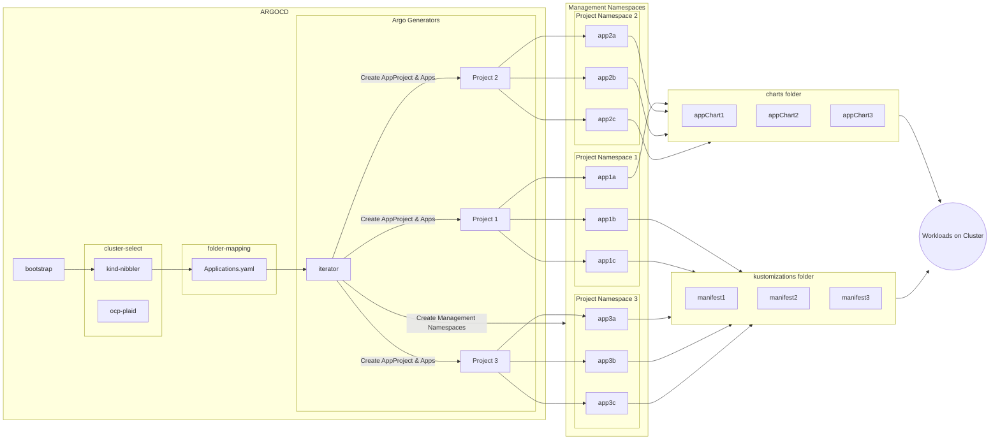

# ArgoCD Application Generator Helm Chart

## Usage

We feed the `applications.yaml` file from a cluster folder.

The Application Generator chart will iterate over apps and deploy AppProjects and Applications manifests.

Strongly coupled groups of Applications should all be bundled into a Project, and that Project should create a single Management Namespace that will hold all the ArgoCD Applications and any required Secrets to be created/injected for the successful deployment of actual workloads.

## Model

