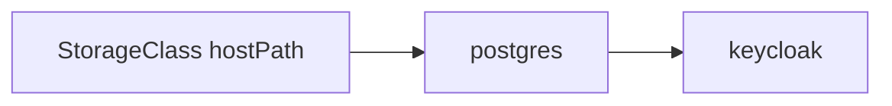

# Dependencies

This is going to start looking like DAG vs. an ArgoCD thing, but it will help inform the syncwave design.

## Diagram

```mermaid
flowchart LR
  keycloak
  postgres
  storageclass["StorageClass hostPath"]

  storageclass-->postgres-->keycloak

```
